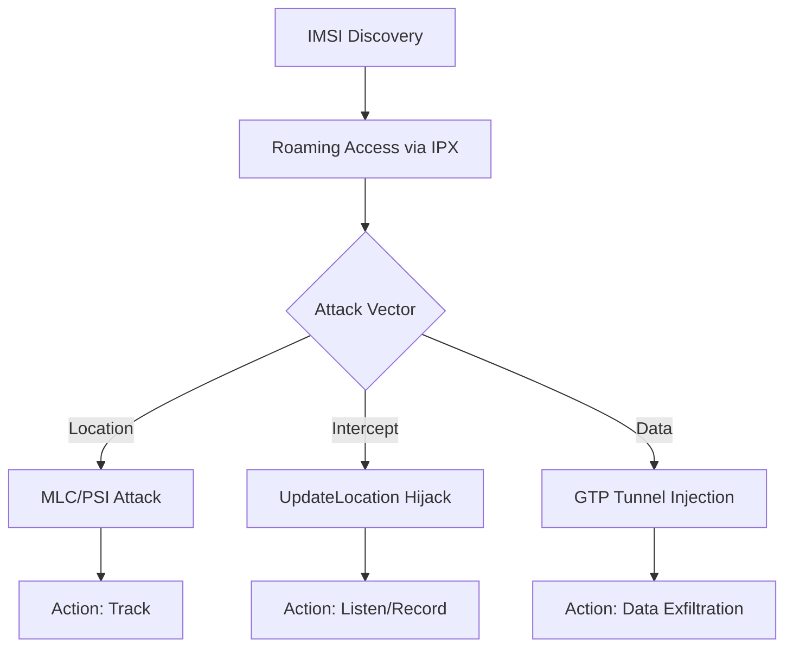

# 📡 Telecom Security Essentials (Telekomünikasyon Sistemleri Güvenliği)

Bu depo; SS7, Diameter ve GTP gibi kritik sinyalleşme protokollerinin güvenliği, modern telekom ağlarındaki (2G/3G/4G/5G) saldırı yüzeyleri ve savunma mimarileri üzerine teknik bir rehber, eğitim materyali ve otonom bir analiz motorudur.

---

## 🚀 1. Protokol Evrimi ve Güvenlik Mimarisi

Mobil ağlar, her nesilde güvenlik mimarisini kökten değiştirmiştir. Aşağıdaki tablo, bu evrimi ve temel güvenlik odaklarını özetler:

| Nesil | Protokol | Güvenlik Modeli | Temel Zafiyet |
| :--- | :--- | :--- | :--- |
| **2G/3G** | SS7 / MAP | Güven Dayalı (Trust-based) | Kimlik Doğrulama Eksikliği |
| **4G/LTE** | Diameter | Protokol Sıkılaştırma (SCTP/TLS) | Interconnect Zafiyetleri |
| **5G** | HTTP/2 (SBA) | Sıfır Güven (Zero Trust / TLS) | API & Bulut Güvenliği |

---

## 🔬 2. Teknik Derinlemesine Bakış (Deep-Dive)

### 📱 SS7 & Diameter (Legacy & Modern Signaling)
Geleneksel sinyalleşme ağları, operatörler arası güven ilişkisine dayanır.
*   **Location Tracking:** `ProvideSubscriberInfo` (PSI) veya `AnyTimeInterrogation` (ATI) mesajlarıyla hücre bazlı konum tespiti.
*   **Interception:** `UpdateLocation` manipülasyonu ile kurbanın profilinin saldırganın kontrolündeki bir santrale (Pseudo-MSC) çekilmesi.

### ⚡ 5G SBA (Service Based Architecture) - Geleceğin Güvenliği
5G ile birlikte telekom dünyası "IT-leşmiş" ve servis tabanlı bir mimariye geçmiştir.
*   **SBI (Service Based Interface):** Protokol olarak HTTP/2 ve veri formatı olarak JSON kullanılır. Bu, telekom ağlarını geleneksel Web saldırılarına (Injection, Broken Auth) açık hale getirir.
*   **SEPP (Security Edge Protection Proxy):** Operatörler arası (roaming) trafiği uçtan uca şifreleyen ve filtreleyen en kritik güvenlik bileşenidir.
*   **Network Slicing Security:** Farklı dilimler (slices) arası izolasyon hataları, bir dilimdeki saldırganın diğerine (örn. Kritik Altyapı dilimi) sızmasına neden olabilir.

---

## 🌪️ 3. Saldırı Yaşam Döngüsü (Attack Lifecycle)

Bir telekom saldırısı genellikle şu aşamalardan geçer:

1.  **Keşif (Reconnaissance):** Global Title (GT) taramaları veya açık kaynak istihbaratı ile hedef abonenin IMSI numarasının tespiti.
2.  **Sızma (Ingress):** IPX/GRX ağları üzerinden veya zayıf yapılandırılmış bir roaming ortağı üzerinden ağa giriş.
3.  **İstismar (Exploitation):** Manipüle edilmiş MAP/Diameter mesajlarının hedef HLR/HSS ünitesine gönderilmesi.
4.  **Analiz (Post-Exploitation):** Ele geçirilen verilerin (lokasyon, ses, SMS) dekoding edilmesi.

---

## 🛠️ 4. Otonom Analiz Motoru

Bu depo, bu zafiyetleri tespit eden modüler bir Python motoru içerir:
- **Merkezi Orkestratör:** Tüm analiz akışını yönetir.
- **Dynamic Signatures:** `config/signatures.yaml` ile imza tabanlı tespit.
- **Reporting:** JSON ve HTML formatında profesyonel rapor üretimi.

---

## 🛡️ 5. Savunma Stratejileri

*   **Signaling Firewall:** Mesajların tipine ve kaynağına göre (Cat-1/2/3) filtrelenmesi.
*   **Home Routing:** Gerçek IMSI ve lokasyonun dış dünyaya kapatılması.
*   **Velocity Check:** Bir abonenin 5 dakika içinde hem İstanbul hem de Berlin'den sinyal vermesinin (imkansız hız) engellenmesi.

---

## 📚 6. Kaynak Arşivi

*   **GSMA FS.11/FS.19:** Endüstri standardı sinyalleşme güvenlik rehberleri.
*   **3GPP TS 33.501:** 5G sistem mimarisi güvenlik prosedürleri.
*   **AdaptiveMobile/Positive Technologies:** Sektör lideri araştırma raporları.

---
> [!IMPORTANT]
> **Etik Uyarı:** Bu materyal yalnızca akademik savunma ve farkındalık amaçlıdır.
