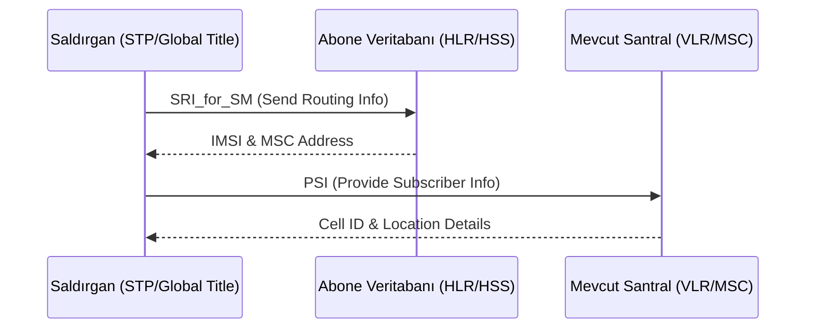

# 📡 Telecom Security Essentials (Telekomünikasyon Sistemleri Güvenliği)

Bu depo; SS7, Diameter ve GTP gibi kritik sinyalleşme protokollerinin güvenliği, modern telekom ağlarındaki (2G/3G/4G/5G) saldırı yüzeyleri ve savunma mimarileri üzerine teknik bir rehber, eğitim materyali ve otonom bir analiz motorudur.

---

## 🚀 1. Teknik Derinlemesine Bakış (Deep-Dive)

Telekomünikasyon güvenliği, geleneksel IP güvenliğinden farklı olarak "Sinyalleşme Düzlemi" (Signaling Plane) odağında gelişir. Aşağıda, bu deponun kapsadığı ana protokollerin güvenlik dinamikleri yer almaktadır:

### 📱 SS7 (Signaling System No. 7) - Legasi Miras
SS7, modern ağların temel taşı olsa da 1970'lerden kalma bir güven modeli üzerine kuruludur.
*   **Kategori 1 Mesajlar (İzinsiz):** Genellikle roaming ortaklarından gelmemesi gereken mesajlar.
*   **Kategori 2 Mesajlar (Anomali):** Beklenen ancak parametreleri (VLR/HLR uyumu gibi) şüpheli olan mesajlar.
*   **Saldırı Senaryosu (Lokasyon Takibi):**

### 🛰️ Diameter (4G/LTE) - Modern Mobilitenin Kalbi
Diameter, SS7'nin yerini almış olsa da benzer mantıksal zafiyetleri IP tabanlı (SCTP/TCP) bir yapıda barındırır.
*   **S6a Arayüzü:** HSS ve MME arasındaki profil transferlerinde zafiyetler (Roaming Profile Hijacking).
*   **Uluslararası Dolaşım (Interconnect):** IPX/GRX ağları üzerinden gelen manipüle edilmiş `Update-Location-Request` (ULR) mesajları ile abonenin veri trafiği başka bir ülkeye yönlendirilebilir.

### 🌐 GTP (GPRS Tunnelling Protocol) - Veri Tünelleme
GTP, mobil verinin paket çekirdek ağda taşınmasını sağlar.
*   **GTP-C (Control Plane):** Oturum yönetimi. Sahte `Create Session Request` ile TEID (Tunnel Endpoint ID) çakışmaları yaratılarak DoS saldırıları düzenlenebilir.
*   **GTP-U (User Plane):** Kullanıcı verisi. Tünel içine kapsüllenmiş trafik üzerinden Firewall atlatma teknikleri uygulanabilir.

---

## 🛠️ 2. Otonom Analiz Motoru

Bu depo, yukarıdaki protokollerdeki zafiyetleri tespit eden bir Python motoru içerir:
- **Merkezi Orkestratör:** Tüm protokol analizlerini koordine eder.
- **Dinamik İmza Sistemi:** `config/signatures.yaml` üzerinden kod gerektirmeden yeni saldırı kalıpları eklenebilir.
- **Profesyonel Raporlama:** Her tarama sonrası `reports/` altında JSON ve HTML formatında detaylı bulgular üretir.

---

## 🛡️ 3. Savunma ve Sıkılaştırma (Hardening)

Telekom ağlarını savunmak için "Savunma Derinliği" (Defense in Depth) prensibi uygulanmalıdır:
1. **Signaling Firewall (DAA/STP FW):** Gelen mesajların kategori bazlı (Cat-1/2/3) filtrelenmesi.
2. **Home Routing:** SMS ve lokasyon sorgularının doğrudan aboneye değil, bir proxy üzerinden geçirilerek gizlenmesi.
3. **Anomaly Detection:** Coğrafi olarak imkansız hız (Geographical Velocity Check) gibi mantıksal kontrollerin yapılması.

---

## 📚 4. Eğitim Kaynakları ve Lab

| Kaynak | Tip | Açıklama |
| :--- | :--- | :--- |
| **GSMA FS.11** | Standart | SS7 Güvenlik İzleme ve Filtreleme Rehberi. |
| **GSMA FS.19** | Standart | Diameter Güvenlik Rehberi. |
| **3GPP TS 33.210** | Teknik | Network Domain Security (NDS); IP-based control plane security. |
| **Osmocom** | Araç | Açık kaynaklı mobil şebeke simülasyon araçları. |

---
> [!IMPORTANT]
> **Etik Uyarı:** Bu araç ve bilgiler yalnızca akademik araştırma ve siber savunma farkındalığı içindir. İzinsiz ağlar üzerinde kullanılması yasal sonuçlar doğurabilir.
