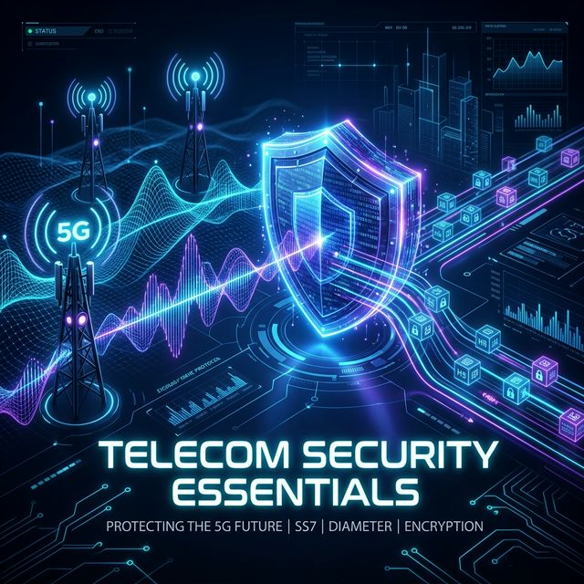
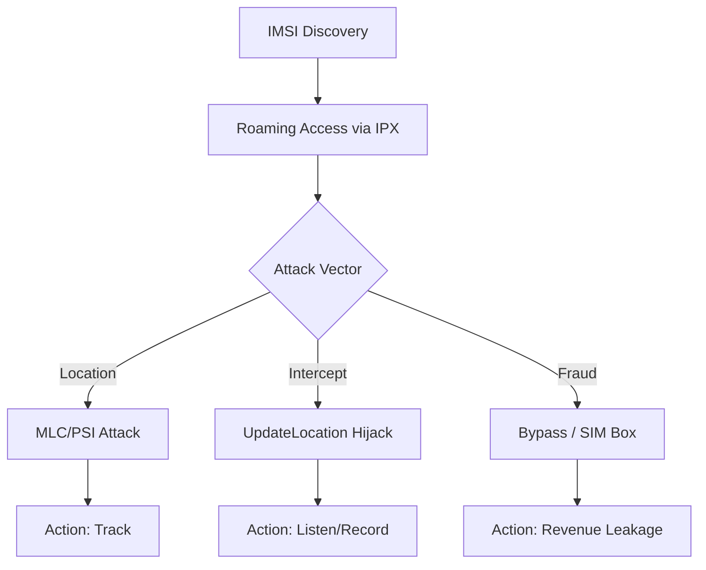

# 📡 Telecom Security Essentials (Telekomünikasyon Sistemleri Güvenliği)

Bu depo; SS7, Diameter ve GTP gibi kritik sinyalleşme protokollerinin güvenliği, modern telekom ağlarındaki (2G/3G/4G/5G) saldırı yüzeyleri ve savunma mimarileri üzerine teknik bir rehber, eğitim materyali ve otonom bir analiz motorudur.

---

## 🚀 1. Protokol Evrimi ve Güvenlik Mimarisi

Mobil ağlar, her nesilde güvenlik mimarisini kökten değiştirmiştir. Aşağıdaki tablo, bu evrimi ve temel güvenlik odaklarını özetler:

| Nesil | Protokol | Güvenlik Modeli | Temel Zafiyet |
| :--- | :--- | :--- | :--- |
| **2G/3G** | SS7 / MAP | Güven Dayalı (Trust-based) | Kimlik Doğrulama Eksikliği |
| **4G/LTE** | Diameter | Protokol Sıkılaştırma (SCTP/TLS) | Interconnect Zafiyetleri |
| **5G** | HTTP/2 (SBA) | Sıfır Güven (Zero Trust / TLS) | API & Bulut Güvenliği |

---

## 🔬 2. Teknik Derinlemesine Bakış (Core Protocols)

### 📱 SS7 & Diameter (Signaling Plane)
Geleneksel sinyalleşme ağları, operatörler arası güven ilişkisine dayanır.
*   **Location Tracking:** `ProvideSubscriberInfo` (PSI) veya `AnyTimeInterrogation` (ATI) mesajlarıyla hücre bazlı konum tespiti.
*   **Interception:** `UpdateLocation` manipülasyonu ile kurbanın profilinin saldırganın kontrolündeki bir santrale (Pseudo-MSC) çekilmesi.

### ⚡ 5G SBA (Service Based Architecture)
5G ile telekom dünyası servis tabanlı bir mimariye (SBA) geçmiştir.
*   **SBI (Service Based Interface):** Protokol olarak HTTP/2 ve veri formatı olarak JSON kullanılır. Bu, telekom ağlarını geleneksel Web saldırılarına (Injection, Broken Auth) açık hale getirir.
*   **SEPP (Security Edge Protection Proxy):** Operatörler arası (roaming) trafiği uçtan uca şifreleyen ve filtreleyen en kritik güvenlik bileşenidir.

### 🌐 GTP (Data Plane & Tunneling)
GTP, mobil verinin paket çekirdek ağda taşınmasını sağlar.
*   **GTP-C (Control):** Tünel yönetimi. Sahte `Create Session Request` ile DoS saldırıları düzenlenebilir.
*   **GTP-U (User):** Tünel içi kapsüllenmiş trafik üzerinden Firewall atlatma teknikleri.

---

## 🤖 3. İleri Düzey Teknolojiler (O-RAN & NTN)

### 🗼 O-RAN (Open RAN) Güvenliği
Open RAN, radyo erişim şebekesini açık arayüzlerle modüler hale getirir.
*   **RIC (RAN Intelligent Controller):** Ağın beynidir. xApps ve rApps uygulama zafiyetleri ağın performansını veya güvenliğini sabote edebilir.
*   **Interface Security:** E2, A1 ve O1 arayüzlerinin TLS ile korunmaması, saldırganın radyo kaynaklarını manipüle etmesine yol açar.

### 🛰️ 5G NTN (Non-Terrestrial Networks)
Uydu tabanlı 5G haberleşmesi, yeni fiziksel saldırı yüzeyleri açar.
*   **Jamming & Spoofing:** Uydu sinyallerinin karıştırılması veya sahte yer istasyonları üzerinden trafiğin ele geçirilmesi.
*   **Mobility Management:** Uyduların hızlı hareketi nedeniyle anahtarlama (handover) süreçlerindeki güvenlik açıkları.

### ⚛️ Post-Quantum Cryptography (PQC)
Telekom ağları, kuantum bilgisayarların mevcut şifreleme yöntemlerini (RSA/ECC) kırma riskine karşı PQC'ye geçmektedir.
*   **Lattice-based Crypto:** 5G AKA ve sinyalleşme güvenliğinde kuantum dayanıklı algoritmaların (Kyber, Dilithium) entegrasyonu.

---

## 🌪️ 4. Saldırı Yaşam Döngüsü & Fraud Analizi

### 🚨 Saldırı Aşamaları (Attack Flow)

---

## 🛡️ 5. Savunma Stratejileri & Uyumluluk

### 📋 Global Standartlar Matrisi
| Kurum | Standart | Fokus |
| :--- | :--- | :--- |
| **GSMA** | FS.11 / FS.19 | SS7 & Diameter Security Monitoring |
| **3GPP** | TS 33.501 | 5G Security Architecture |
| **NIST** | SP 800-187 | 4G LTE Security Guide |
| **O-RAN Alliance** | WG11 | Open RAN Security Specs |

---

## 🛠️ 6. Otonom Analiz Motoru & Lab

Bu depo, bu zafiyetleri tespit eden modüler bir Python motoru içerir:
- **Merkezi Orkestratör:** Tüm analiz akışını yönetir.
- **Dynamic Signatures:** `config/signatures.yaml` ile imza tabanlı tespit.
- **Reporting:** JSON ve HTML formatında profesyonel rapor üretimi.

---

## 📚 7. Kaynak Arşivi

*   **GSMA Standard Documents** (FS.11, FS.19)
*   **3GPP Security Specifications** (TS 33.x series)
*   **AdaptiveMobile & PT Security Reports**

---
> [!IMPORTANT]
> **Etik Uyarı:** Bu materyal yalnızca akademik araştırma ve siber savunma farkındalığı içindir.
